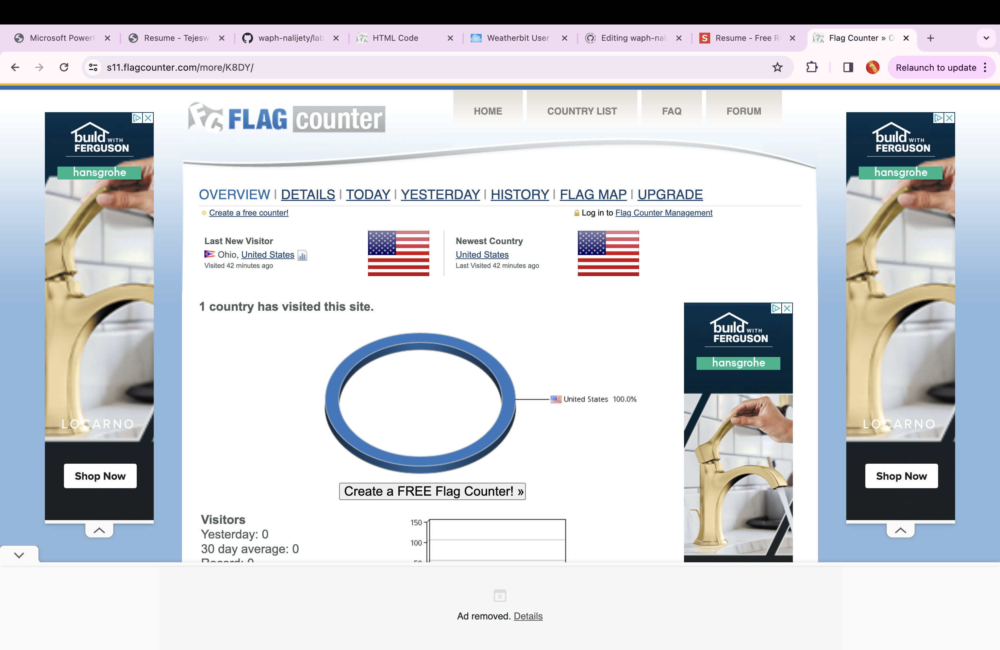

# WAPH-Web Application Programming and Hacking

## Instructor: Dr. Phu Phung

## Student

**Name**: Tejeswar Reddy Nalijeni

**Email**: nalijety@mail.uc.edu

**Short-bio**: Currently I am pursuing Master's in Information Technology and I am interested in Cybersecurity.


# Individual Project 1
## Front-end Web Development with a Professional Profile Website on github.io cloud service

## Overview and Requirements 

In this project, I'm honing my front-end web development skills by crafting a Professional Profile Website. Leveraging the github.io cloud service, I'm not only showcasing my expertise but also gaining practical experience in deployment. The project entails meeting both general and technical requisites, from setting up github.io to implementing Bootstrap for a polished portfolio display. JavaScript functionalities are seamlessly integrated to enhance user interaction. At the heart of the website lies the index.html page, meticulously designed with seven tabs catering to various facets of my professional journey. These tabs cover essential sections such as about me, experience, education, skills, interests, certifications, and explore more which provides visitors with a comprehensive overview of my profile.

Link to the repository:
[https://github.com/nalijety/nalijety.github.io/blob/main/README.md](https://github.com/nalijety/nalijety.github.io/blob/main/README.md)

Link to the portfolio:
[https://nalijety.github.io/index.html](https://nalijety.github.io/index.html)

### General Requirements
 -I've started my personal website, "nalijety.github.io," with just basic details about me and no fancy design yet. It's like a starting point for me to make it look better and add more cool stuff later on. I'll be adding style and more features to make it a nice place to show off my skills and what I've done.
 [https://nalijety.github.io/resume.html](https://nalijety.github.io/resume.html)

 

- I have added a "Coursework" section to the index.html page under the "Explore Me" tab, showcasing all the work completed thus far in the WAPH course. This section features contains PDFs of all the lab reports and hackathon submissions, providing a comprehensive overview of my progress and achievements in the course. Users can easily access and review the coursework materials directly from the website.


 ​
### Non-Technical Requirements
- I've integrated an open-source Bootstrap template into my portfolio, complete with a page tracker for enhanced navigation. Within the Portfolio section, I've meticulously crafted sections tailored to highlight my profile for job applications. These sections encompass crucial areas such as about me, work experience, education background, skillset, personal interests, certifications earned, and a Explore more section for additional details. This comprehensive approach ensures that potential employers can easily access and evaluate my qualifications and suitability for roles.


- The next thing I added is that "Flag Counter" tracker analytics which is used to track the number of visitors with their number of visits with location of their country and their device.

```JS
<div><a href="https://info.flagcounter.com/K8DY"></a></div>
```



## Technical requirements
### Task 1 : Basic Javascript Code
In the "Explore More" tab, I have incorporated several dynamic features to enhance user engagement. These include a digital clock and an analog clock for timekeeping, a toggle to show or hide my email address, and a unique wishing feature that dynamically adjusts based on the time of day, offering personalized greetings such as "GOOD MORNING!!," "GOOD AFTERNOON!!," or "GOOD EVENING!!." The wish is initially displayed as an alert and then seamlessly integrated into the page for a welcoming touch. These interactive elements add flair and functionality to the website, enriching the user experience.
```JS
 <div id="digit-clock"></div>
                <script>
                    function displayTime() {
                        document.getElementById('digit-clock').innerHTML = "Current time:" + new Date();
                    }
                    setInterval(displayTime, 500);
                    function validateInput(inputId) {
                        var input = document.getElementById(inputId).value;
                        if (input.length === 0) {
                            alert("Please enter some text");
                            return false;
                        }
                        return true;
                    }
                    function encodeInput(input) {
                        const encodedData = document.createElement('div');
                        encodedData.innerText = input;
                        return encodedData.innerHTML;
                    }

                </script>
                <div id="email" onclick="showhideEmail()">Show my Email</div>
                <a href="/waph.html">Click here for my Course Work</a>

                <h3>Analog Clock</h3>
                <div>
                    <canvas id="analog-clock" width="150" height="150" style="background-color:#999"></canvas>
                </div>
```

- Below is the aditional functionality which wishes the users.
```JS
// greetings.js
const Greeting = () => {
  const currentHour = new Date().getHours();
  let greetingMessage;

  if (currentHour >= 5 && currentHour < 12) {
    greetingMessage = 'Good Morning!!!';
  } else if (currentHour >= 12 && currentHour < 17) {
    greetingMessage = 'Good Afternoon!!!';
  } else {
    greetingMessage = 'Good Evening!!!';
  }

  alert(greetingMessage); // Alert moved outside of the conditional statement

  return React.createElement('h2', null, greetingMessage);
};

ReactDOM.render(React.createElement(Greeting, null), document.getElementById('greeting-root'));
```
### Task 2 : Public APIs Integration
### Joke API:
In this task, I have integrated the joke API in the "index.html" which is updated automatically for each and every minute. [https://v2.jokeapi.dev/joke/Any](https://v2.jokeapi.dev/joke/Any)
```JS
       <b>Joke &#x1F606;</b>
                <div id="joke"></div>
                <script>
                    // Function to fetch and display a joke
                    function fetchJoke() {
                        fetch('https://v2.jokeapi.dev/joke/Any')
                            .then(response => response.json())
                            .then(data => {
// Check if the joke is a single joke or a setup and delivery
const joke = data.type === 'single' ? data.joke : `${data.setup}<br>${data.delivery}`;
                                // Display the joke
                                document.getElementById('joke').innerHTML = joke;
                            })
                            .catch(error => {
                                console.error('Error fetching joke:', error);
                            });
                    }
            
                    // Fetch a joke immediately when the page loads
                    fetchJoke();

                    // Fetch a new joke every 1 minute
                    setInterval(fetchJoke, 60000);
                </script>
```
### Dog API:
For this task, I've added a feature that fetches random pictures of dogs from a public API (https://dog.ceo/dog-api/). Each time you visit or refresh the page, you'll see a new picture of a dog. It's a fun addition that keeps things fresh and adds a bit of enjoyment to the website. [https://dog.ceo/api/breeds/image/random](https://dog.ceo/api/breeds/image/random)

```JS
<h4>Random Dog Image</h4>
                
            
                <script>
                    fetch('https://dog.ceo/api/breeds/image/random')
                        .then(response => response.json())
                        .then(data => {
                            const dogImage = document.getElementById('dog-image');
                            dogImage.src = data.message;
                        })
                        .catch(error => console.error('Error fetching data:', error));
                </script> 
```


### Integration of Cookies 
I've implemented the use of "setCookie()" and "getCookie()" functions to manage and display personalized messages on my portfolio website. Upon visiting the site, users are greeted with the message "Welcome to my portfolio," which is stored as a cookie. Additionally, the website also displays a message indicating the user's last visit along with the date. This personalized touch enhances the user experience and makes the website feel more welcoming and interactive.
```JS
<script>
//other script
<div id1="greetingCookie">Hello</div>
//other script
     function setCookie(name, value, expiryDays) {
            const d = new Date();
            d.setTime(d.getTime() + (expiryDays*24*60*60*1000));
            let expires = "expires="+ d.toUTCString();
            document.cookie = name + "=" + value + ";" + expires + ";path=/";
        }

        function getCookie(name) {
            let cookName = name + "=";
            let decodedCookie = decodeURIComponent(document.cookie);
            let ca = decodedCookie.split(';');
            for(let i = 0; i <ca.length; i++) {
                let c = ca[i];
                while (c.charAt(0) == ' ') {
                    c = c.substring(1);
                }
                if (c.indexOf(cookName) == 0) {
                    return c.substring(cookName.length, c.length);
                }
            }
            return "";
        }

        function welcomeUser() {
            const lastVis = getCookie("lastVis");
            const greetEle = document.getElementById("greetingCookie");
            if (lastVis) {
                greetEle.innerHTML = "Welcome back! Your last visit was on " + lastVis + ".";
            } else {
                greetEle.innerHTML = "Welcome to my portfolio!";
            }
            const now = new Date();
            setCookie("lastVis", now.toLocaleString(), 365);
        }

        welcomeUser();
```

